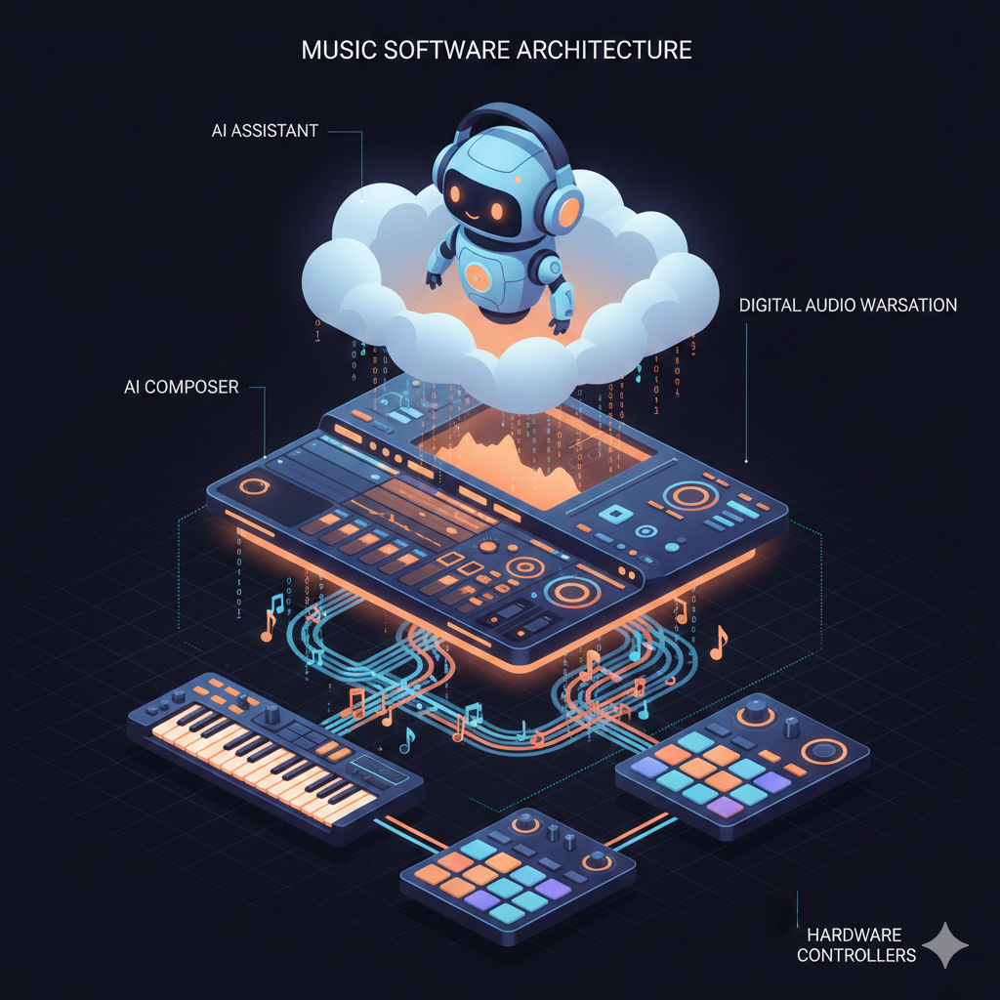
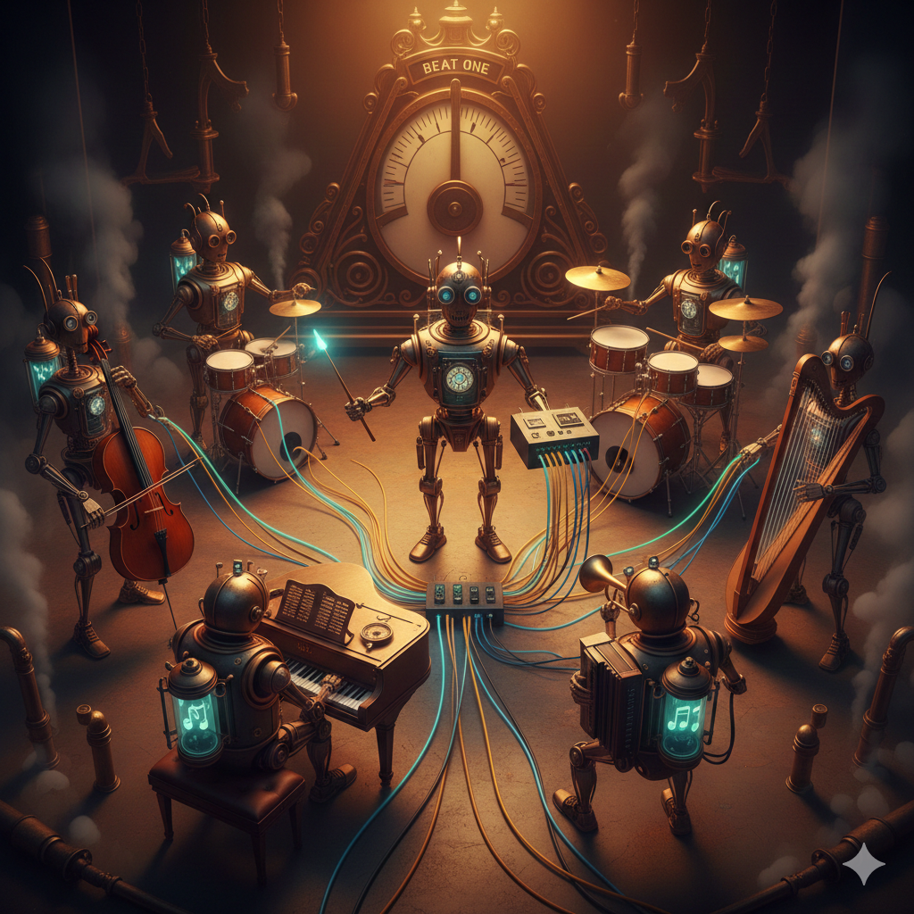

# Understanding Bitwig Development: Plugins, Extensions, and AI Integration

This document explains how software developers can extend Bitwig Studio, a digital audio workstation, through plugins and controller extensions. It is written for curious humans who may be encountering these concepts for the first time, whether you are a musician wondering how your hardware controller talks to your DAW, a programmer interested in audio software, or someone exploring the intersection of artificial intelligence and music production.

## What is a Digital Audio Workstation?

A digital audio workstation, commonly abbreviated as DAW, is software that lets you record, edit, and produce music on a computer. Think of it as a virtual recording studio. Where a physical studio has mixing consoles, tape machines, and racks of audio processors, a DAW provides all of these capabilities in software. Bitwig Studio is one such DAW, created by a German company and known for its modular design and deep integration with hardware controllers.

When you open Bitwig, you see tracks running horizontally across your screen, a timeline for arranging music, and panels for browsing sounds and adjusting parameters. But beneath this visual interface lies a rich programming environment that developers can tap into. This is where our story begins.

## Two Ways to Extend Bitwig

Bitwig can be extended in two fundamentally different ways, and understanding the distinction is crucial. The first way is through audio plugins, which process or generate sound. The second way is through controller extensions, which let external hardware and software communicate with Bitwig to control its features. These two extension types serve different purposes, run in different contexts, and are built using different technologies.


*The layers of music software integration: AI assistants in the cloud, the DAW interface, and hardware controllers connected by flowing data streams.*

### Audio Plugins: The Sound Processors

Audio plugins are pieces of software that plug into the signal chain of your DAW. They come in several formats, with names like VST3, Audio Unit, and CLAP. When you add a reverb effect to a vocal track or load a virtual synthesizer to play melodies, you are using audio plugins.

The newest plugin format is called CLAP, which stands for CLever Audio Plug-in. It was developed collaboratively by Bitwig and u-he, a respected synthesizer company, along with contributions from the broader audio development community. CLAP was designed to address limitations in older formats and is completely open source, meaning anyone can examine its specification and implement it without paying licensing fees.

What makes CLAP particularly interesting for our purposes is its extensibility. The core CLAP specification defines how plugins handle audio and respond to note events, but it also allows for optional extensions that add new capabilities. One such extension is called track-info, which lets a plugin know the name and color of the track it sits on. This might seem like a small detail, but it opens the door to plugins that can adapt their behavior based on their context within a project.

### The Audio Thread: A World of Constraints

Plugins run on the audio thread, a special high-priority execution context that processes sound samples in real time. This environment is unforgiving. If your code takes too long to execute or tries to allocate memory, you will hear clicks, pops, or silence. The audio thread demands absolute discipline from developers, which is why plugin development has traditionally required expertise in low-level languages like C and C++.


*Two parallel worlds: the calm main thread where a conductor can pause mid-gesture, and the intense audio thread where a drummer plays at incredible speed. The barrier between them carries a stark warning: do not pause.*

To understand the severity of this constraint, consider what happens when a DAW plays audio. At a typical sample rate of 48,000 samples per second, the audio thread must process each buffer of samples in a fraction of a millisecond. If the thread blocks waiting for memory allocation, file I/O, or a lock held by another thread, the audio output will glitch audibly. Users do not tolerate this. They will uninstall your plugin and leave a one-star review.

The forbidden operations on the audio thread include:

- **Memory allocation**: No `new`, `malloc`, `String::from()`, or `Vec::push()`. Every byte of memory must be allocated ahead of time.
- **File I/O**: No reading or writing files. Logging to disk is not allowed.
- **Locking**: No mutexes that might block. Lock-free data structures or try-lock patterns are required.
- **System calls**: No network operations, no spawning threads, no printing to stdout.

This is why audio programming is considered a specialized discipline. The rules are strict, and violating them produces immediate, audible consequences.

### Controller Extensions: The Communicators

Controller extensions occupy a different space entirely. They do not process audio. Instead, they act as bridges between Bitwig and the outside world. When you connect a hardware controller like an Ableton Push or a Novation Launchpad, a controller extension translates the button presses and knob turns into actions within Bitwig. It also sends information back to the controller, lighting up buttons and updating displays.

Controller extensions are written in Java, a language chosen for its stability and the wealth of libraries available for tasks like networking and data processing. Unlike plugins, extensions run on the main thread of the application, meaning they can safely interact with the user interface and perform operations that would be forbidden on the audio thread.

The Bitwig Controller API provides access to nearly everything in the DAW: transport controls for play and stop, track banks for accessing mixer parameters, device chains for navigating through effects and instruments, and much more. The API follows an observer pattern. When you want to know when something changes, you register a callback. When you want to make changes, you call methods on API objects.

A critical detail that trips up many newcomers: you must call `markInterested()` on any value you want to observe. Bitwig optimizes by not computing or sending updates for values that no one is watching. If you forget this call, your callbacks will never fire and you will spend hours wondering why.

```java
// This won't work - callbacks never fire
track.name().addValueObserver(name -> {
    host.println("Track name: " + name);
});

// This works - tell Bitwig you care about this value
track.name().markInterested();
track.name().addValueObserver(name -> {
    host.println("Track name: " + name);
});
```

The most prominent example of a controller extension is DrivenByMoss, created by Jürgen Moßgraber. This single extension supports dozens of hardware controllers from various manufacturers, implementing features that often exceed what the manufacturers themselves provide. Its development thread on the KVR Audio forum spans hundreds of pages and serves as an informal gathering place for the Bitwig controller scripting community.

## Building Plugins with nih-plug and Rust

While C and C++ have long dominated plugin development, a newer approach has emerged using the Rust programming language. Rust offers memory safety guarantees that prevent entire classes of bugs that plague C and C++ codebases, while still providing the low-level control and performance that audio processing demands.

The nih-plug framework, created by Robbert van der Helm, allows developers to write CLAP and VST3 plugins in Rust. The name comes from a Dutch expression, and the framework has gained popularity for its ergonomic design and thoughtful handling of the complexities inherent in plugin development. It provides abstractions for parameters, user interfaces, and the various plugin format specifications, letting developers focus on their audio processing logic rather than boilerplate code.

### The Plugin Trait

At the heart of nih-plug is the `Plugin` trait. Your plugin implements this trait, providing methods that the framework calls at appropriate times:

```rust
impl Plugin for MyPlugin {
    fn params(&self) -> Arc<dyn Params> {
        self.params.clone()
    }

    fn process(
        &mut self,
        buffer: &mut Buffer,
        _aux: &mut AuxiliaryBuffers,
        context: &mut impl ProcessContext<Self>,
    ) -> ProcessStatus {
        // This runs on the audio thread
        // Every sample passes through here
        for channel_samples in buffer.iter_samples() {
            for sample in channel_samples {
                *sample *= self.params.gain.smoothed.next();
            }
        }
        ProcessStatus::Normal
    }
}
```

The `process` method is where audio happens. It receives a buffer of samples, transforms them, and returns. This method runs tens of thousands of times per second. Everything you learned about audio thread constraints applies here. No allocations. No I/O. No blocking.

### Thread Safety with Arc and AtomicRefCell

Sharing data between the audio thread and the GUI thread requires careful coordination. Rust's ownership system helps here, but you still need appropriate concurrency primitives.

The `Arc<AtomicRefCell<T>>` pattern is commonly used. `Arc` provides thread-safe reference counting for shared ownership. `AtomicRefCell` provides interior mutability with runtime borrow checking that panics rather than blocking:

```rust
// GUI thread can update this
let track_info = Arc::new(AtomicRefCell::new(TrackInfo::default()));

// Audio thread uses try_borrow() to avoid blocking
if let Ok(info) = track_info.try_borrow() {
    // Use the data
}
```

The key is `try_borrow()` rather than `borrow()`. If the data is currently borrowed mutably by the GUI thread, `try_borrow()` returns an error rather than waiting. The audio thread can then proceed without the data rather than blocking.

### Debugging Without a Debugger

One challenge with nih-plug, and with plugin development in general, is debugging. When something goes wrong in a plugin, you cannot simply attach a debugger the way you might with a regular application. Bitwig runs plugins in sandboxed processes for stability, which means the plugin lives in a separate address space from the main DAW.

For logging and diagnostic output, nih-plug provides a macro called `nih_log!` that writes messages to a file or standard error stream. You can control where this output goes by setting an environment variable called `NIH_LOG` before launching Bitwig:

```bash
# Log to a file
export NIH_LOG=/tmp/my-plugin.log

# Log to stderr (appears in terminal if Bitwig launched from terminal)
export NIH_LOG=stderr

# Launch Bitwig to pick up the variable
/Applications/Bitwig\ Studio.app/Contents/MacOS/BitwigStudio
```

**Critical warning**: Do not call `nih_log!()` from the audio thread in production. The macro allocates memory and performs I/O, both forbidden operations. Use it only during development, and wrap calls in debug-only conditionals.

### Forking Dependencies

Real-world plugin development often requires modifying framework code. Our project maintains forks of several dependencies:

**nih-plug fork** (`audio-forge-rs/nih-plug`): We added support for the CLAP track-info extension, allowing plugins to know which track they are on. This required exposing the CLAP host's track-info callback through nih-plug's abstraction layers.

**baseview fork** (`audio-forge-rs/baseview`): We fixed a null pointer crash in macOS view initialization that occurred under specific conditions.

**egui-baseview fork** (`audio-forge-rs/egui-baseview`): Updated to use our forked baseview.

Maintaining forks is a responsibility. You must track upstream changes and periodically merge them. But when you need functionality that upstream does not provide, forking is the right choice.

## Building Extensions with Java

Creating a controller extension begins with understanding Java's Service Provider Interface, or SPI. Bitwig uses SPI to discover extensions at startup. Your JAR file must include a special file at a specific path:

```
META-INF/services/com.bitwig.extension.ExtensionDefinition
```

This file contains a single line: the fully qualified name of your extension definition class:

```
com.yourcompany.yourextension.YourExtensionDefinition
```

Without this file, Bitwig will not find your extension. The extension will not appear in the "Add Controller" menu. You will see no error messages. Your extension simply does not exist as far as Bitwig is concerned.

Another critical requirement: the Bitwig API dependency must be marked as `provided` scope in your Maven configuration:

```xml
<dependency>
    <groupId>com.bitwig</groupId>
    <artifactId>extension-api</artifactId>
    <version>19</version>
    <scope>provided</scope>
</dependency>
```

If you accidentally bundle the Bitwig API classes in your JAR, Bitwig will fail to load your extension. The API must come from Bitwig's runtime, not from your JAR.

### The Extension Lifecycle

Your extension has two main classes. The definition class provides metadata:

```java
public class GilliganExtensionDefinition extends ControllerExtensionDefinition {
    @Override
    public String getName() { return "Gilligan"; }

    @Override
    public String getAuthor() { return "Audio Forge RS"; }

    @Override
    public int getRequiredAPIVersion() { return 19; }

    @Override
    public GilliganExtension createInstance(ControllerHost host) {
        return new GilliganExtension(this, host);
    }
}
```

The extension class contains your logic:

```java
public class GilliganExtension extends ControllerExtension {
    @Override
    public void init() {
        // Called when Bitwig loads your extension
        // Set up observers, create banks, start servers
    }

    @Override
    public void exit() {
        // Called when Bitwig unloads your extension
        // Clean up resources, stop servers
    }

    @Override
    public void flush() {
        // Called periodically to send updates to hardware
    }
}
```

### The Controller Script Console

For debugging, Bitwig provides a Controller Script Console that displays output from your extension. Finding it is surprisingly difficult for newcomers. The most reliable method:

1. Press **Cmd+Enter** (Mac) or **Ctrl+Enter** (Windows/Linux) to open Commander
2. Type **console**
3. Select **Show Control Script Console**

Any calls to `host.println()` in your extension code will appear in this window. You can also type **restart** in the console to reload your extension after making changes.

For more sophisticated debugging, you can configure Bitwig to accept debugger connections by setting an environment variable:

```bash
export BITWIG_DEBUG_PORT=5005
/Applications/Bitwig\ Studio.app/Contents/MacOS/BitwigStudio
```

Your Java IDE can then connect to `localhost:5005` and stop at breakpoints. Be aware that Bitwig will freeze completely when it hits a breakpoint, including audio output. This is normal but can be disorienting.

### Network Access from Extensions

Java extensions have full network access. You can run HTTP servers, WebSocket servers, OSC endpoints, or any other network service. This capability is what makes AI integration possible.

DrivenByMoss uses OSC (Open Sound Control) to communicate with external applications. OSC is a UDP-based protocol popular in the music and multimedia world for its simplicity and low latency.

Our project uses HTTP with Server-Sent Events for MCP communication. The choice depends on your requirements. OSC is simpler but unidirectional. HTTP is more complex but supports request-response patterns that MCP requires.

**Thread safety warning**: Networking code runs on threads other than Bitwig's Control Surface thread. Calling Bitwig API methods from network handler threads may be unsafe. The common pattern is to queue commands and process them during the `flush()` callback, which runs on the correct thread.

## The MCP Protocol and AI Integration

The Model Context Protocol, abbreviated as MCP, is a specification developed by Anthropic that allows AI assistants like Claude to interact with external tools and services. Think of it as a standardized way for an AI to extend its capabilities beyond pure text processing. Through MCP, an AI can query databases, read files, and control software.

### How MCP Works

MCP uses JSON-RPC over various transports. The most common transport for web-based tools is HTTP with Server-Sent Events (SSE). The protocol flow works like this:

1. **Connection**: The client connects to an SSE endpoint (e.g., `/sse`)
2. **Session**: The server assigns a session ID and sends it via SSE
3. **Initialize**: The client POSTs an initialization request with protocol version
4. **List Tools**: The client requests the list of available tools
5. **Call Tools**: The client calls tools as needed, receiving responses via SSE

Each tool has a name, description, and JSON schema for its parameters:

```java
McpSchema.Tool tool = McpSchema.Tool.builder()
    .name("transport_play")
    .description("Start playback")
    .inputSchema(McpSchema.EMPTY_OBJECT_SCHEMA)
    .build();
```

When the AI decides to use a tool, it sends a request. The server executes the action and returns a result. The AI incorporates this result into its reasoning.

### Embedding an MCP Server

Our Gilligan extension embeds a Jetty HTTP server that speaks MCP:

```java
public void start() throws Exception {
    // Create SSE transport provider
    HttpServletSseServerTransportProvider transportProvider =
        new HttpServletSseServerTransportProvider(objectMapper, "/mcp", "/sse");

    // Build MCP server
    mcpServer = McpServer.sync(transportProvider)
        .serverInfo("Gilligan", "0.1.0")
        .capabilities(McpSchema.ServerCapabilities.builder()
            .tools(true)
            .resources(false, false)
            .prompts(false)
            .build())
        .build();

    // Register tools
    mcpServer.addTool(TransportPlayTool.create(facade, host));
    mcpServer.addTool(ListTracksTool.create(facade, host));
    // ... more tools

    // Configure and start Jetty
    jettyServer = new Server(new QueuedThreadPool());
    ServerConnector connector = new ServerConnector(jettyServer);
    connector.setPort(61170);
    // ... setup and start
}
```

Stopping the server requires care. You must wait for Jetty to fully release the port before restarting:

```java
public void stop() {
    if (jettyServer != null) {
        jettyServer.stop();
        jettyServer.join();  // Critical: wait for full shutdown
        jettyServer = null;
    }
}
```

Without the `join()` call, rapid restart cycles will fail with "Address already in use" errors.

### Claude Code Configuration

To connect Claude Code to your MCP server, create a configuration file at `~/.claude/mcp.json`:

```json
{
  "mcpServers": {
    "gilligan": {
      "transport": "sse",
      "url": "http://localhost:61170/sse"
    }
  }
}
```

After restarting Claude Code, the tools from your server will be available for the AI to use.

## The Challenge of Coordination

One of the most interesting problems in this space involves coordinating actions across multiple components. Consider a scenario where an AI wants to change the musical programs playing on several tracks simultaneously, timed to land exactly on the next downbeat of a measure. This requires a level of timing precision that controller extensions cannot provide on their own.

Controller extensions run on the main thread and can ask Bitwig to perform actions, but they cannot control exactly when those actions occur at the sample level. For beat-accurate synchronization, you need code running on the audio thread, which means you need a plugin. But plugins, by design, only see their own slice of the signal chain and cannot communicate with other plugins or with the DAW's broader state.

The solution involves a hybrid architecture. A controller extension serves as the central coordinator, receiving commands from the AI through MCP. It communicates with special-purpose plugins placed on each track that needs synchronized changes. These plugins maintain staging buffers where they hold prepared musical content. When the extension signals a commit, each plugin watches the transport position in its audio processing callback and releases its staged content at precisely the right moment.


*Robot musicians on a steampunk stage, each connected by glowing threads to a central conductor. Buffer tanks hold staged musical notes, waiting for the metronome to strike beat one. The moment before synchronized action.*

This architecture exploits the strengths of each component type. The extension handles networking, command processing, and coordination logic that would be inappropriate for the audio thread. The plugins handle sample-accurate timing that would be impossible from the main thread. Together, they achieve capabilities that neither could accomplish alone.

### Plugin Instance Identification

A subtle challenge arises: how does the controller extension know which plugin is on which track?

Neither CLAP nor VST3 provide unique instance identifiers. The CLAP track-info extension provides the track name, but multiple tracks can share the same name. There is no track ID, no plugin UUID.

Our solution: each Skipper plugin generates its own UUID on instantiation. When Gilligan starts, Skipper instances register with it: "I am UUID X, on a track named Y with color Z." Gilligan uses the Bitwig Controller API to find matching tracks and builds a mapping from UUID to real track ID.

This registration pattern is common when coordinating multiple plugin instances. The controller extension becomes a registry, and plugins check in with whatever identifying information they have.

## The KVR Audio Community

Throughout this exploration, one resource appears repeatedly: the KVR Audio forum. This online community has served as a gathering place for audio software developers and enthusiasts since the early days of virtual instruments. The forum hosts dedicated sections for different DAWs, including Bitwig, as well as a DSP and Plugin Development section where deeply technical discussions unfold.

The DrivenByMoss support thread alone spans hundreds of pages, documenting not just the extension itself but the evolution of the Bitwig Controller API over many years. When developers encounter obstacles, they often find that someone on KVR has already worked through the same problem. The forum represents institutional knowledge that no official documentation fully captures.

For newcomers to Bitwig development, browsing these threads can be illuminating even if you do not understand every detail. You begin to see patterns in how experienced developers approach problems, what tools they reach for, and where the rough edges of the platform lie. This contextual knowledge proves invaluable when you encounter your own challenges.

## Looking Forward

The convergence of AI assistance and music production software is still in its early stages. Projects like Gilligan represent experiments in what becomes possible when you give an AI the ability to control a professional creative tool. Perhaps an AI could help with the tedious aspects of music production, like organizing session files or setting up routing. Perhaps it could offer suggestions based on its understanding of music theory and production techniques. Perhaps it could enable entirely new workflows that we have not yet imagined.

What seems certain is that the building blocks are now in place. The CLAP plugin format provides a modern foundation for audio processing. Controller extensions offer deep integration with DAW functionality. The MCP protocol establishes conventions for AI tool access. And frameworks like nih-plug lower the barrier to entry for developers who want to work in this space without learning C++.

The path from here leads through continued experimentation, community collaboration, and the gradual accumulation of knowledge about what works and what does not. Every developer who shares their findings, whether on KVR or GitHub or anywhere else, contributes to a collective understanding that benefits everyone who follows.

---

## Resources

For those who wish to explore further, the following resources provide starting points for different aspects of Bitwig development:

**Official Documentation**
- Bitwig Controller API documentation is accessible through Help in Bitwig Studio itself
- The CLAP specification lives at [github.com/free-audio/clap](https://github.com/free-audio/clap)
- The MCP specification is documented at [modelcontextprotocol.io](https://modelcontextprotocol.io)

**Community Forums**
- [KVR Audio Bitwig Forum](https://www.kvraudio.com/forum/viewforum.php?f=259)
- [KVR Audio Controller Scripting Forum](https://www.kvraudio.com/forum/viewforum.php?f=268)
- [KVR Audio DSP and Plugin Development Forum](https://www.kvraudio.com/forum/viewforum.php?f=33)

**Example Projects**
- [DrivenByMoss](https://github.com/git-moss/DrivenByMoss) - The reference implementation for Bitwig controller extensions
- [WigAI](https://github.com/fabb/WigAI) - MCP server for Bitwig by Fabian Birklbauer
- [nih-plug](https://github.com/robbert-vdh/nih-plug) - Rust framework for audio plugins
- [clap-saw-demo](https://github.com/surge-synthesizer/clap-saw-demo) - Example CLAP plugin demonstrating key features

**Tutorials**
- [Keith McMillen Controller Scripting Series](https://www.keithmcmillen.com/blog/controller-scripting-in-bitwig-studio-part-1/)
- [Bitwig Controller Tutorial](https://github.com/outterback/bitwig-controller-tutorial) - Java extension setup guide

The journey of learning never truly ends, but with these resources and the knowledge shared by those who came before, you have a solid foundation from which to begin.

---

*The illustrations in this document were created using AI image generation based on conceptual prompts describing the architecture, the audio thread challenge, and the coordination dance between plugins and extensions.*
